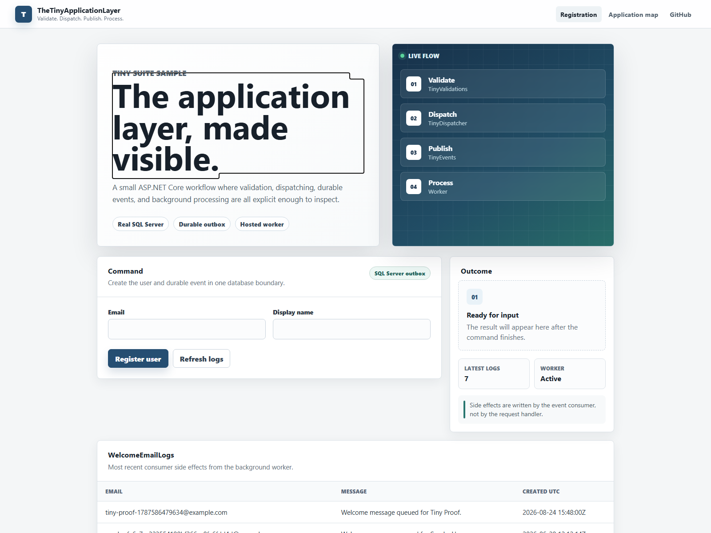
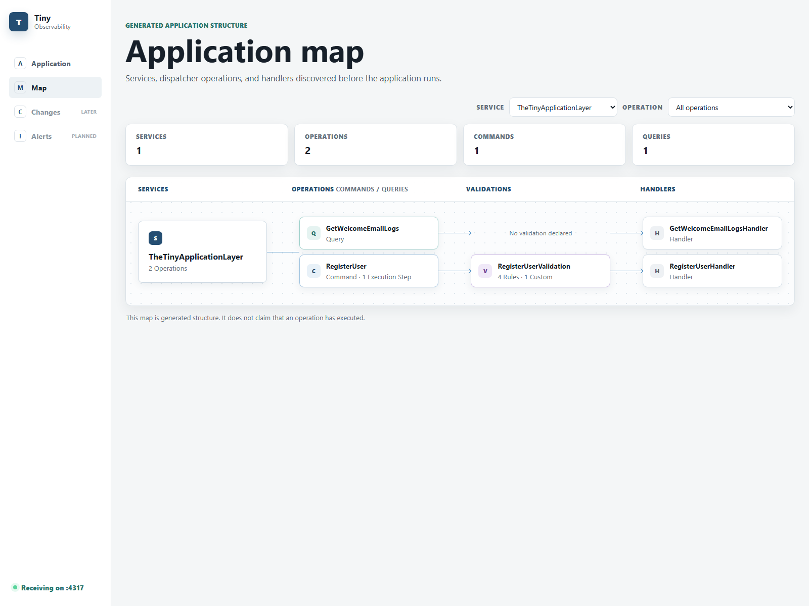
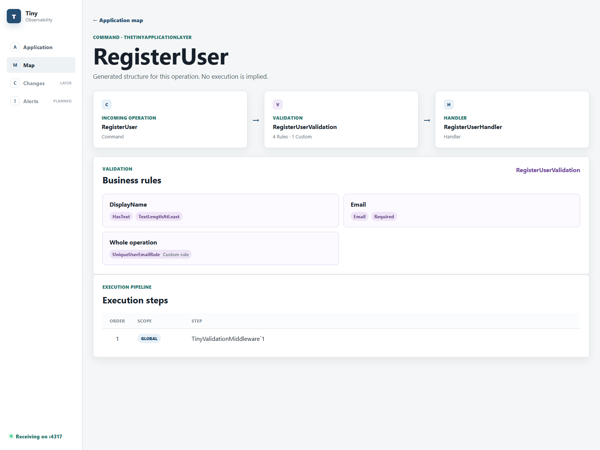

# TheTinyApplicationLayer

TheTinyApplicationLayer is a small ASP.NET Core + Blazor sample that shows how the Tiny suite fits together in a real application layer.

It is intentionally tiny: one user registration flow, one validation step, one command handler, one durable event, one worker, and one consumer side effect.

The goal is not to provide a production template. The goal is to make the boundaries easy to see.



## Why This Sample Exists

The Tiny packages are small on purpose. Each one solves a narrow application-layer problem:

- TinyValidations answers: "Is this command valid before the use case runs?"
- TinyDispatcher answers: "How do I send this command or query to the right handler?"
- TinyEvents answers: "How do I publish an event without losing it if the process dies?"
- TinyEvents.Worker answers: "How do pending outbox events get processed later?"

This sample puts those pieces together in one ordinary ASP.NET Core app so you can see the full path from UI input to durable side effect.

## The Story

The sample implements a single workflow: registering a user.

```text
Blazor form
-> Minimal API endpoint
-> TinyDispatcher
-> TinyValidations middleware
-> RegisterUserHandler
-> EF Core saves the user
-> TinyEvents writes UserRegistered to the outbox
-> TinyEvents.Worker reads the outbox
-> CreateWelcomeEmailLog consumer runs
-> WelcomeEmailLogs records the side effect
```

The important idea is that the user and the event are saved durably before the asynchronous side effect runs. That makes the event processing visible, repeatable, and resilient.

## See The Application Structure

The cold map is collected from the application structure without executing a command. It shows the operations, validations, generated pipeline metadata, and handlers that compose the sample.



Select an operation to inspect its business rules and execution steps without coupling the dashboard to TinyDispatcher or TinyValidations.



## What Uses What

### Web project

`TheTinyApplicationLayer.Web` owns the HTTP and UI surface.

It contains:

- the Blazor form
- the Minimal API endpoints
- app startup
- TinyEvents worker registration
- validation problem-details middleware

It references:

- `TinyDispatcher`
- `TinyValidations`
- `TinyEvents.Worker`
- the Application project
- the Infrastructure project

### Application project

`TheTinyApplicationLayer.Application` owns the application layer.

It contains:

- commands and queries
- handlers
- validation rules
- domain entities used by the sample
- event definitions
- event consumers
- the EF Core application DbContext

It references:

- `TinyDispatcher`
- `TinyValidations`
- `TinyEvents`
- `TinyEvents.SqlServer.EntityFrameworkCore`

### Infrastructure project

`TheTinyApplicationLayer.Infrastructure` owns concrete persistence services.

It contains:

- SQL Server DbContext registration
- EF Core implementations for application interfaces

It references:

- `Microsoft.EntityFrameworkCore.SqlServer`
- `TinyEvents.SqlServer.EntityFrameworkCore`
- the Application project

## Run The Complete Demo

The complete showcase starts with one command:

```bash
docker compose up -d
```

Docker Compose starts:

- SQL Server on `localhost:14333`
- TheTinyApplicationLayer on [http://localhost:5041](http://localhost:5041)
- TinyObservability on [http://localhost:5080](http://localhost:5080)
- the application-map gRPC endpoint on `localhost:4317`

Open the [cold application map](http://localhost:5080/map?service=TheTinyApplicationLayer) directly, or use the **Application map** link in the sample header.

Stop the complete demo with:

```bash
docker compose down
```

### Local Observability Prerequisites

The Observability packages are not public yet. This temporary showcase expects the repositories to be sibling directories and consumes:

- the already packaged ApplicationMap adapters from `../TinyObservability/artifacts/tiny-local-feed`
- the already published Server files from `../TinyObservability/artifacts/server-publish`

`TinyDispatcher` and `TinyValidations` still come from NuGet using their real public versions. Docker Compose does not build or package any Tiny library.

## Why Docker Compose Is Required

This sample uses SQL Server because TinyEvents is an outbox-first library.

The interesting behavior only appears when events are stored durably and processed later by a worker. A real database lets the sample demonstrate:

- transaction boundaries
- outbox persistence
- worker claiming
- event processing
- consumer side effects

In development, the sample uses `EnsureCreatedAsync` to create the schema. Production applications should use migrations. The EF Core model includes `Users`, `WelcomeEmailLogs`, and the TinyEvents outbox table through `modelBuilder.UseTinyEventsOutbox()`.

## What To Try

Open the app and submit the Register User form.

Before the worker processes the event:

- `Users` contains the registered user.
- `TinyOutbox` contains the serialized `UserRegistered` event.

After the worker processes the event:

- `WelcomeEmailLogs` contains the consumer side effect.
- The TinyEvents outbox row is marked processed according to TinyEvents behavior.

For this sample, the TinyEvents worker runs in the same ASP.NET Core host. In production, it could run in a separate worker process using the same database.

## Good Places To Read First

Start here:

- `src/TheTinyApplicationLayer.Web/Users/RegisterUserEndpoint.cs`
- `src/TheTinyApplicationLayer.Application/Users/RegisterUser/RegisterUser.cs`
- `src/TheTinyApplicationLayer.Application/Users/RegisterUser/RegisterUserValidation.cs`
- `src/TheTinyApplicationLayer.Application/Users/RegisterUser/RegisterUserHandler.cs`
- `src/TheTinyApplicationLayer.Application/Users/RegisterUser/UserRegistered.cs`
- `src/TheTinyApplicationLayer.Application/Users/RegisterUser/CreateWelcomeEmailLog.cs`
- `src/TheTinyApplicationLayer.Infrastructure/Persistence/ApplicationDbContext.cs`
- `src/TheTinyApplicationLayer.Web/Program.cs`

Read more in [TinySuite sample notes](docs/tiny-suite.md).

## Package Versions

Verified against nuget.org on August 24, 2026:

- `TinyValidations` `1.1.0-beta.2`
- `TinyDispatcher` `1.3.0-beta.3`
- `TinyEvents` `0.1.0-alpha.2`
- `TinyEvents.SqlServer.EntityFrameworkCore` `0.1.0-alpha.2`
- `TinyEvents.Worker` `0.1.0-alpha.2`

TinyEvents is still alpha, so APIs may change before 1.0.

## Tiny Suite Repositories

- [TinyDispatcher](https://github.com/george2006/TinyDispatcher) — command and query dispatching for explicit use-case execution.
- [TinyValidations](https://github.com/george2006/TinyValidations) — small source-generated validation for application commands.
- [TinyEvents](https://github.com/george2006/TinyEvents) — durable domain and application events with outbox-first publishing.
- [TheTinyApplicationLayer](https://github.com/george2006/TheTinyApplicationLayer) — this end-to-end sample showing the suite working together.
